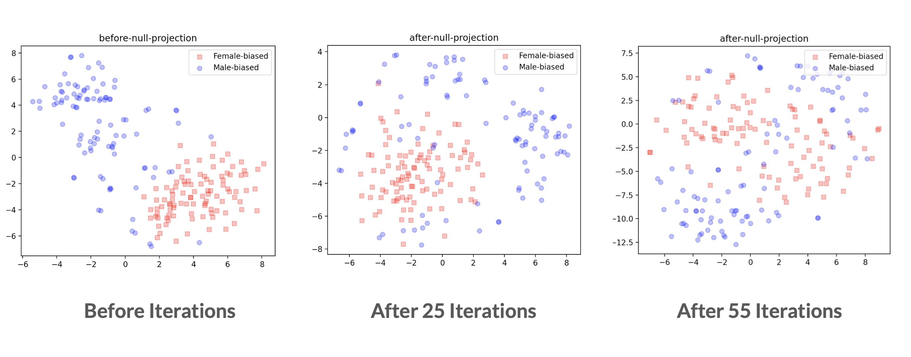
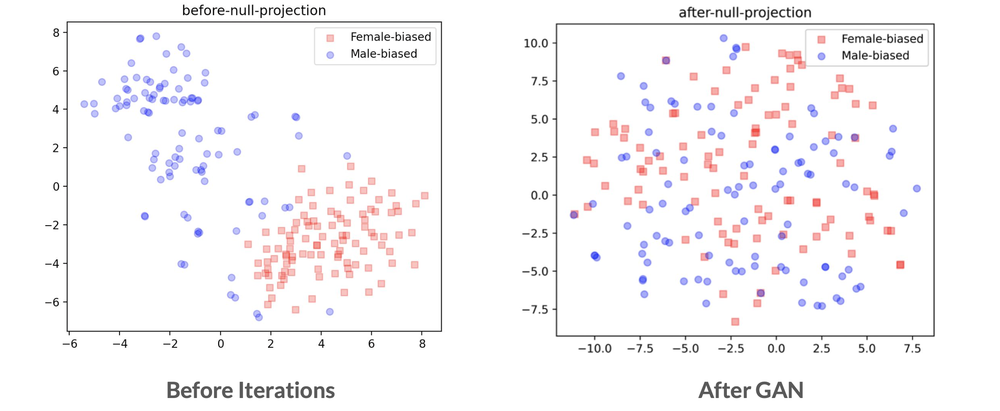

Contextual language models (CLM) such as BERT has been proven to be powerful in many NLP tasks during recent years. However, the blind application of these models can possibly lead to amplification of the biases intrinsic within the original dataset used to train the model. It is shown in [previous work](https://arxiv.org/abs/2009.05021) that even for models like BERT, there exists some gender bias exhibited to an annoying extent.

In this project, we focus on detecting and reducing existing stereotypical conditions across gender while also ensuring the debiasing techniques do not go too far to affect underlying model performance by filtering a group of natural-gendered tokens and excluding them out during the debiasing process. We append an extra gender-debiasing layer after the word-embedding generation layer of BERT and implement two methods to reduce gender bias in word tokens:
* Use Iterative Nullspace Projection (INLP)

* Build a generative adversarial network (GAN)

